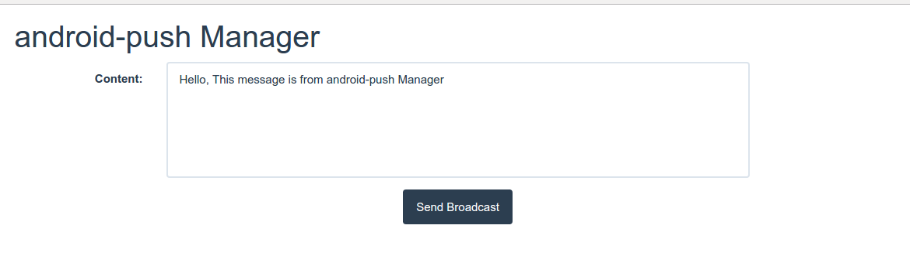
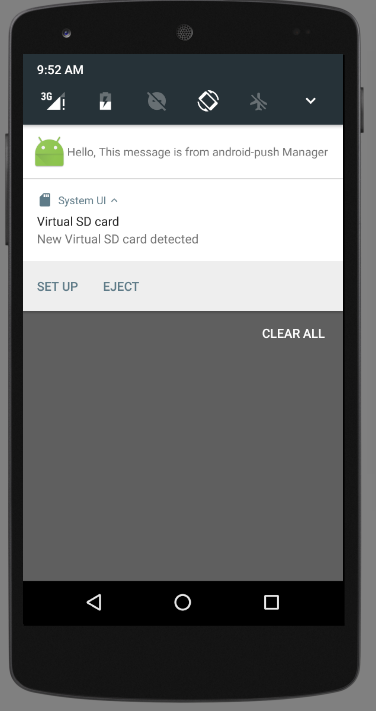

# android-push
android push server cluster and client based on https://github.com/Terry-Mao/goim.

## Installation

- Install goim server, check it out [here](./android-push-server).
- [Modify serverIp](android-push-client/app/src/main/java/kalen/app/android_push_client/util/C.java) based on ifconfig command.

## Result
### Manager UI

### Client UI

## LICENSE
MIT

